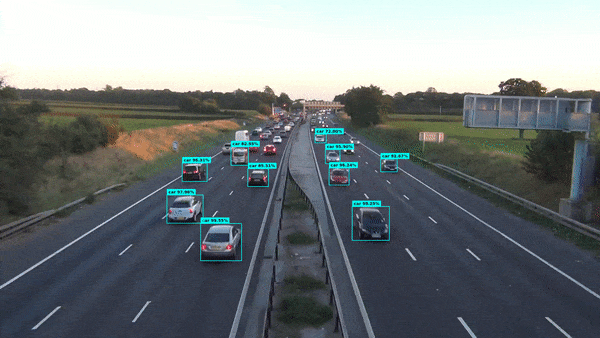

# gst-darknet



gst-darknet is a GStreamer plugin that allows to use [Darknet](https://github.com/AlexeyAB/darknet) (neural network framework) inside GStreamer, to perform object detection against files or real-time streams. For instance, the video above was generated with this command:
```
gst-launch-1.0 \
filesrc location=test.mp4 ! decodebin ! videoconvert \
! darknetinfer config=yolov4.cfg weights=yolov4.weights \
! darknetrender labels=coco.names \
! videoconvert \
! xvimagesink sync=1
```

The plugin provides these elements:
* `darknetinfer`, that runs Darknet against one or multiple input videos
* `darknetprint`, that prints the detected objects to stdout
* `darknetrender`, that draws the detected objects on the input video

## Installation

1. [Install CUDA Toolkit](https://developer.nvidia.com/cuda-downloads).

2. Install build dependencies:
   ```
   sudo apt update && sudo apt install -y \
   git \
   make \
   pkg-config \
   g++ \
   libgstreamer-plugins-base1.0-dev \
   libcairo2-dev
   ```

3. Clone the repository, enter into the folder, initialize submodules:
   ```
   git clone https://github.com/aler9/gst-darknet \
   && cd gst-darknet \
   && git submodule update --init
   ```

4. Compile and install:
   ```
   make -j$(nproc) \
   && sudo make install
   ```

## Basic usage

1. Download config, weights, class labels and a sample video:
   ```
   wget https://raw.githubusercontent.com/AlexeyAB/darknet/master/cfg/yolov4.cfg \
   && wget https://github.com/AlexeyAB/darknet/releases/download/darknet_yolo_v3_optimal/yolov4.weights \
   && wget https://raw.githubusercontent.com/AlexeyAB/darknet/master/data/coco.names \
   && wget https://raw.githubusercontent.com/aler9/gst-darknet/master/test/test.mp4
   ```

2. Launch the pipeline:
   ```
   gst-launch-1.0 \
   filesrc location=test.mp4 ! decodebin ! videoconvert \
   ! darknetinfer config=yolov4.cfg weights=yolov4.weights \
   ! darknetrender labels=coco.names \
   ! videoconvert \
   ! xvimagesink sync=1
   ```

## Advanced usage and FAQs

### Use a RTSP stream instead of a file

Launch the pipeline:
```
gst-launch-1.0 \
rtspsrc location=rtsp://myurl:554/mypath ! decodebin ! videoconvert \
! darknetinfer config=yolov4.cfg weights=yolov4.weights \
! darknetrender labels=coco.names \
! videoconvert \
! xvimagesink sync=1
```

### Print detections to stdout

Launch the pipeline:
```
gst-launch-1.0 \
filesrc location=test.mp4 ! decodebin ! videoconvert \
! darknetinfer config=yolov4.cfg weights=yolov4.weights \
! darknetprint labels=coco.names \
! fakesink
```

### Save video with detections to disk

Launch the pipeline:
```
gst-launch-1.0 \
filesrc location=test.mp4 ! decodebin ! videoconvert \
! darknetinfer config=yolov4.cfg weights=yolov4.weights \
! darknetrender labels=coco.names \
! videoconvert \
! x264enc \
! mp4mux \
filesink location=output.mp4
```

### Process multiple inputs at once

Launch the pipeline:
```
gst-launch-1.0 \
darknetinfer name=d config=yolov4.cfg weights=yolov4.cfg.weights \
multifilesrc location=dog.jpg caps="image/jpeg,framerate=20/1" ! jpegdec ! videoconvert ! video/x-raw,format=RGB \
! d.sink_0 d.src_0 ! darknetrender labels=coco.names ! videoconvert ! xvimagesink sync=1 \
multifilesrc location=giraffe.jpg caps="image/jpeg,framerate=20/1" ! jpegdec ! videoconvert ! video/x-raw,format=RGB \
! d.sink_1 d.src_1 ! darknetrender labels=coco.names ! videoconvert ! xvimagesink sync=1
```

### Element documentation

`darknetinfer` properties:
* `config`: path to a Darknet config file
* `weights`: path to a Darknet weights file
* `probability-threshold`: probability threshold of detected objects (default is 0.7)
* `nms-threshold`: NMS threshold of detected objects (default is 0.45)
* `print-fps`: periodically print FPS to stdout (default is TRUE)
* `print-fps-period`: Period of FPS printing in seconds (default is 5)

`darknetprint` properties:
* `labels`: path to a label file

`darknetrender` properties:
* `labels`: path to a label file
* `box-color`: color of the boxes in HTML format (default is 00FFFF)
* `text-color`: color of the text in HTML format (default is 000000)


### Export detections

One of the ways to export detections consists in launching GStreamer through a C program that makes use of the GStreamer API. The detections are then available in a C struct (`GstDarknetMetaDetection`) and can be exported in any desired way.

1. Copy [examples/export.c](examples/export.c) in an empty folder, edit to suit needs.

2. Compile:
   ```
   gcc -Ofast -Werror -Wall -Wextra -Wno-unused-parameter \
   -I/path-to-gst-darknet \
   export.c -o export \
   $(pkg-config --cflags --libs gstreamer-app-1.0)
   ```

3. Launch:
   ```
   ./export
   ```

## Links

* Darknet (AlexeyAB) https://github.com/AlexeyAB/darknet
* Darknet (pjreddie) https://github.com/pjreddie/darknet
